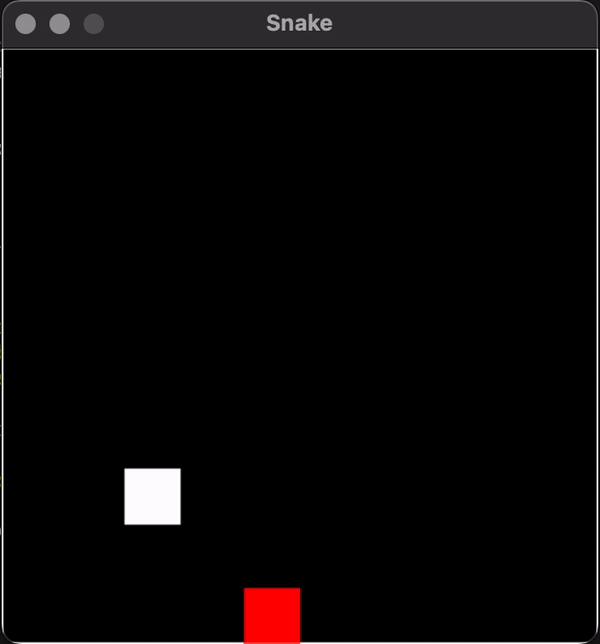

# sdl-snake

<p align="center"></p>

# Installing dependencies

You need: `sdl2`, `sdl2_ttf`, and `pkg-config` (to generate compiler flags)

If you use Homebrew, you can run this:

```sh
make install_dependencies_mac
```

# Compiling

```sh
make compile
```

Note: If this fails, make sure that the following line generates a bunch of compiler flags: `pkg-config --cflags --libs SDL2_ttf`

# Running

```sh
chmod +x ./run

./run
```
